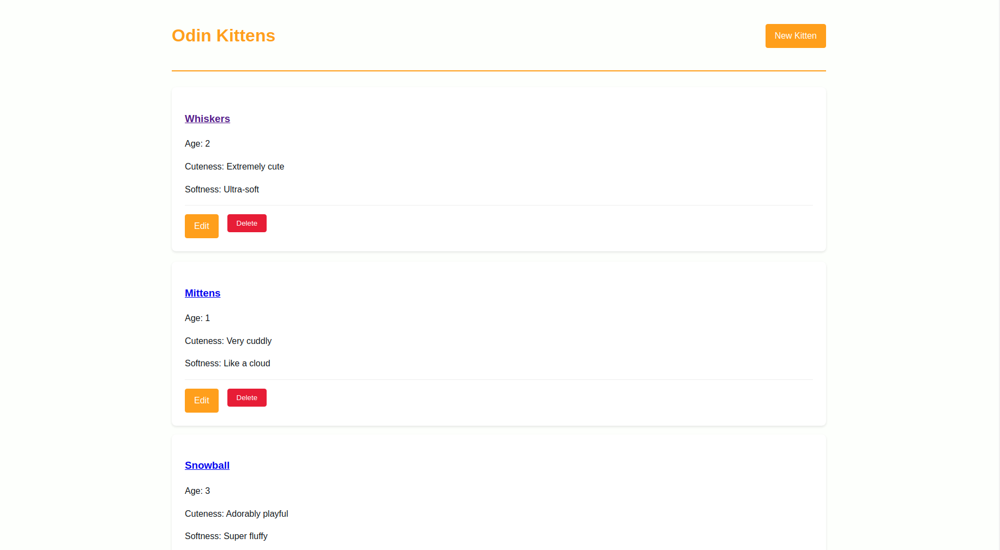

# Odin Kittens 🐱

A simple Rails application for managing kitten profiles. Built as part of practicing Rails fundamentals.
## Screenshot_1

## Screenshot_2

## Screenshot_3

## Features
- Create new kitten profiles
- View all kittens in a list
- See detailed kitten information
- Edit existing kitten details
- Delete kittens (😿)
- Flash messages for user feedback

## Installation
1. Clone repo:  
`git clone git@github.com:fabortwell/kittens_api.git`
2. Install dependencies:  
`bundle install`
3. Setup database:  
`rails db:create db:migrate db:seed`
4. Start server:  
`rails server`
5. Visit `http://localhost:3000`

## Seeding Sample Data
Pre-loaded with 5 adorable kittens:  
`rails db:seed`

## Technologies
- Ruby on Rails
- Sqlite
- ERB views

---

*"What greater gift than the love of a cat?" - Charles Dickens*
